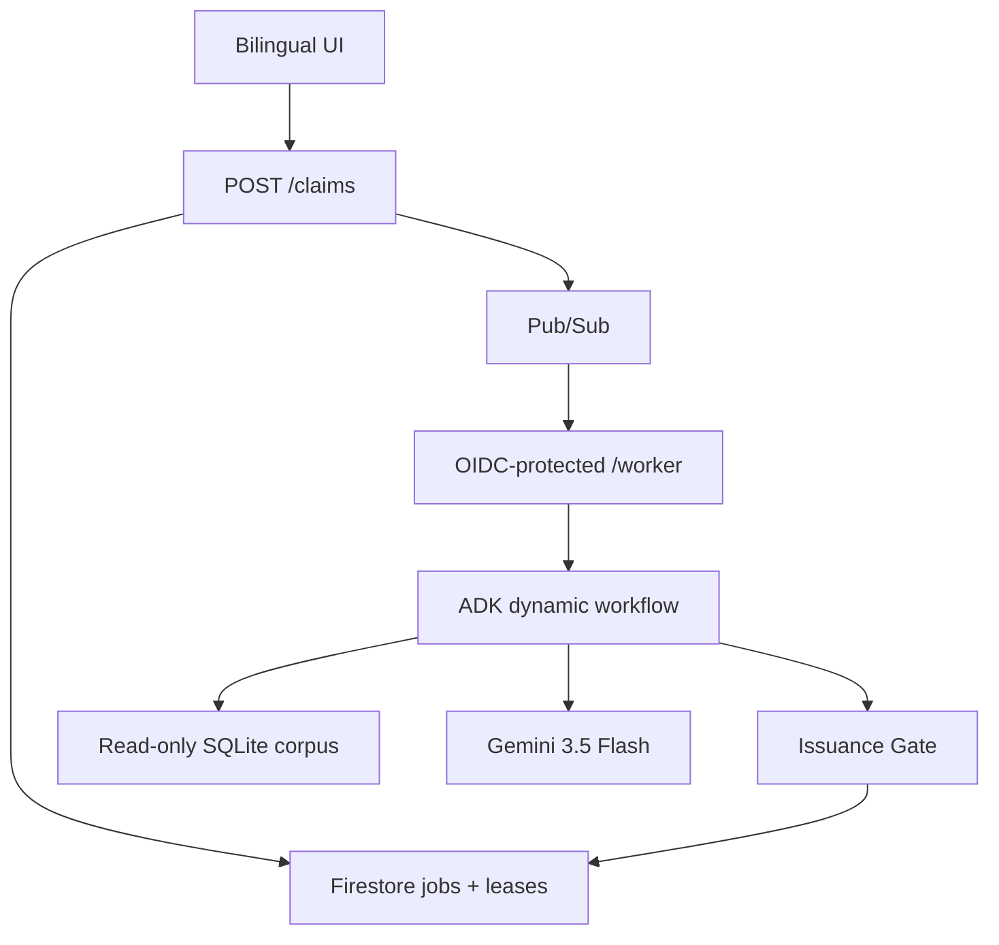

# TAKHRIJ · تخريج

TAKHRIJ tests one falsifiable, corpus-bounded historical-linguistics claim:

> No target-use attestation of any enumerated variant of form X, in intended sense S,
> occurs before cutoff Y AH within release R and book list B.

It searches exact normalized tokens, classifies their contexts, requires a Devil's Advocate
to audit the search trace, optionally searches missed variants, and releases a dossier only
after a deterministic Issuance Gate verifies every quote, source, offset, and date field.

This repository implements Revision 4.1. It intentionally does not contain a production
OpenITI corpus. The included `data/takhrij.db` is built from two clearly labelled synthetic
sentences so the index, verdict reversal, and Gate can be tested without redistributing
licensed corpus data or pretending the fixtures are historical evidence.

## Current status

| Layer | Status |
|---|---|
| SQLite index, offsets, retrieval, verdicts, Gate | Implemented and locally tested |
| Leases, duplicate delivery, stale-attempt CAS, terminal failure | Implemented and locally tested |
| ADK 2.x dynamic workflow, three model roles, deterministic tool registry | Implemented and executed end-to-end with deterministic model doubles |
| Bilingual web UI and four routes | Implemented and covered by HTTP tests |
| Container, Cloud Build, IAM and Pub/Sub setup scripts | Prepared, not executed against a Google Cloud account |
| Production OpenITI release and book list | Deliberately blocked pending licence resolution and selection |
| Live Gemini/Firestore/Pub/Sub integration | Deliberately blocked pending cloud credentials and project setup |

Verification snapshot (26 Aug 2026): 42 tests pass, including an actual ADK `Runner` execution
with all six registered `FunctionTool` objects observed in the run; branch coverage meets the
configured 85% threshold. Ruff, Python compilation, shell syntax, JavaScript syntax, Cloud Build
YAML parsing, and the runtime-provider scan are clean. A container build remains unexecuted in
this environment because no Docker-compatible engine is installed.

## Architecture



ADK is load-bearing. `takhrij_orchestrator` owns the ordered nodes, the second retrieval pass,
and progress events. The Morphologist, Assessor, and Devil's Advocate are `LlmAgent` nodes.
Normalization, validation, retrieval, quote extraction, and span verification are exposed as
`FunctionTool` objects. The orchestrator executes those exact tool objects through
`ctx.run_node`; the registry is therefore load-bearing, while a model never gets discretion over
whether a string exists.

| Gemini judges | Code establishes |
|---|---|
| Same-lexeme morphological forms | Non-destructive normalization |
| `target_use` / `homograph` / `quotation` / `uncertain` | Exact postings lookup |
| Weak trace or missing variant | Raw quote extraction and offset verification |
| Contextual reasons | Verdict derivation and dossier assembly |

## Claim input correction

Revision 4.1 names `target_use` as “the sense under investigation” but lists only form and year
as inputs. A classifier cannot distinguish a homograph without knowing the intended sense.
The implementation therefore requires `target_sense`. This closes the contract; it does not
add a claim type or product feature.

```json
{
  "form": "تخريج",
  "target_sense": "دليل يُستند إليه في الاستدلال",
  "cutoff_year_ah": 500
}
```

The server—not the caller—adds the immutable `corpus_release` and `book_ids`.

## Date rule

The comparison year is deterministic:

1. `composition_date_ah`, when documented.
2. Otherwise `author_death_year_ah`, explicitly labelled as a proxy.
3. `edition_date` and `witness_date` are displayed but never silently compared with an AH cutoff.
4. A potentially relevant match without a usable AH comparison year makes the verdict
   `INCONCLUSIVE`.

The dossier states that attribution to an author/date does not prove when a spelling entered
Arabic or whether a later transmission normalized it.

## Retrieval and offsets

`documents` holds raw texts and provenance. `postings` holds normalized single-token forms and
raw Unicode code-point offsets. The browser receives already separated `prefix`, `match`, and
`suffix` strings; it never reinterprets Python offsets as JavaScript UTF-16 offsets. The Gate
compares the selected span as exact UTF-8 bytes and resolves the document again from SQLite.

Normalization removes optional Arabic combining marks and tatweel. Orthographic alternatives are
enumerated visibly: final `ى`/`ي`, plus the first lexical alef seat when present. The alef of the
definite article is never mutated, so a form such as `بالتخريج` cannot produce the false spelling
`بألتخريج`. `ة` and `ه` are never merged.

No vector index is used. Attestation is an existence-of-a-token question, not semantic
similarity. Similarity search would add silent false positives without answering the contract.

## Safety and failure semantics

- Pub/Sub push tokens are signature-verified; `aud` and service-account `email` must exactly
  match deployment configuration.
- Ack deadline: 600 seconds. Worker lease: 900 seconds, renewed every 300 seconds.
- A valid lease returns a non-2xx response so Pub/Sub retries later.
- Expired leases are reclaimable with a new `attempt_id`.
- Final writes are compare-and-set on the current `attempt_id`; stale workers cannot overwrite.
- The fifth failed delivery marks the job failed and releases the public-demo quota while the
  message proceeds to the dead-letter topic.
- One active job and 20 created jobs per UTC day are the default public budget guard.
- More than 200 matches is not sampled into a confident answer; coverage becomes incomplete and
  the verdict becomes `INCONCLUSIVE`.
- A non-`uncertain` model label below the deterministic 0.80 confidence floor is converted to
  `uncertain`; low-confidence `target_use` can never break the claim.

## Local deterministic verification

Python 3.12 is required. Install the pinned runtime before running the complete suite.

```bash
python -m pip install -e .
PYTHONPATH=src python -m takhrij.index_builder \
  config/corpus_manifest.fixture.json data/takhrij.db
PYTHONPATH=src python -m unittest discover -s tests -v
PYTHONPATH=src python scripts/run_fixture_demo.py
```

Expected fixture reversal:

```text
NO_EARLIER_MATCH_IN_DECLARED_CORPUS
→ EARLIER_MATCH_FOUND
```

The output also says `SYNTHETIC FIXTURE — NOT HISTORICAL EVIDENCE`.

## Full local application

On Windows PowerShell:

```powershell
py -3.12 -m venv .venv
.venv\Scripts\Activate.ps1
python -m pip install -e .
$env:APP_ENV = "development"
$env:CORPUS_DB_PATH = "data/takhrij.db"
$env:CORPUS_RELEASE = "FIXTURE-ONLY"
$env:CORPUS_BOOK_IDS = "fixture-early,fixture-late"
$env:PUBSUB_AUDIENCE = "http://localhost:8080/worker"
$env:PUBSUB_SERVICE_ACCOUNT = "local-test@example.invalid"
python -m flask --app "takhrij.web:create_app()" run --port 8080
```

The fixture web app queues jobs but does not call the cloud model unless a worker is invoked
with a valid configured identity. The synthetic reversal script is the offline smoke test.

## Production corpus build

1. Resolve the exact release's permitted use and redistribution terms.
2. Copy `config/corpus_manifest.example.json` to `config/corpus_manifest.json`.
3. Select a small, documented book list and enter AH metadata only where sourced.
4. Place source files outside version control unless permission clearly permits redistribution.
5. Build and inspect the immutable database:

```bash
PYTHONPATH=src python -m takhrij.index_builder \
  config/corpus_manifest.json data/takhrij.db
sqlite3 data/takhrij.db "select * from corpus_metadata;"
```

The manifest release and book IDs must exactly match the production environment or the service
refuses to start.

## Cloud deployment order

1. Run `deploy/bootstrap.sh PROJECT_ID REGION` from Cloud Shell. It enables APIs, creates
   dedicated runtime, push, and build service accounts, creates Firestore if needed, deploys the
   hello container, and refuses to finish until the URL returns `hello`.
2. Resolve and build the production corpus database.
3. Set the non-placeholder Cloud Build substitutions. The audience is the stable Cloud Run URL
   plus `/worker`.
4. Submit `cloudbuild.yaml` once with the dedicated `takhrij-build` service account, then connect
   the repository and create a push-to-main trigger using that same account. Do not assume the
   legacy `${PROJECT_NUMBER}@cloudbuild.gserviceaccount.com` identity exists on a new project.
   The bootstrap grants the dedicated identity the official Cloud Build Service Account role,
   Cloud Run Admin, and only `actAs` access on the Takhrij runtime identity.
5. Run `deploy/configure_pubsub.sh PROJECT_ID REGION` after the real service is live.
6. Replay one Pub/Sub message deliberately and confirm a single final dossier plus multiple
   `attempt_id` log entries.

`cloudbuild.yaml` pins `gemini-3.5-flash`, sets the 60-minute Cloud Run request timeout, and
uses one Gunicorn process with threaded request handling. Cloud Run concurrency is four, while
the Firestore quota transaction permits only one active public research job.

The deployment variable is `GOOGLE_GENAI_USE_ENTERPRISE=True`. In ADK 2.7.1 this is the current
name of the Google Cloud/Vertex path; Google documents it as equivalent to the earlier
`GOOGLE_GENAI_USE_VERTEXAI` name. The runtime service account supplies ADC, so no API key or
service-account key file is shipped.

## Required pre-merge checks

```bash
PYTHONPATH=src python -m unittest discover -s tests -v
python -m compileall -q src scripts tests
python scripts/check_runtime_providers.py
```

A clean provider scan prints no matches. The checker constructs its forbidden terms from fragments
so it does not match its own source.

## Known limits

- Single Arabic tokens only; no phrase matching.
- Corpus-bounded absence only; never historical absence.
- Semantic class is a model judgement and can be wrong.
- The Gate guarantees exact quote/source/metadata linkage, not interpretive correctness.
- The Devil's Advocate audits the trace, not unseen corpus contents.
- No geographic inference, borrowing analysis, accounts, or cross-session learning.

## Licensing boundary

The application code is Apache-2.0. Corpus files are separate inputs and are not relicensed by
this repository. OpenITI's own documentation states that its releases use CC BY-NC-SA 4.0; the
specific 2025.1.9 release is described in the linked record. Cash-prize and submission-licence
compatibility must be confirmed before production indexing. See
[`docs/licensing-checklist.md`](docs/licensing-checklist.md).

## Current authoritative references (verified 26 Aug 2026)

- [ADK 2.x dynamic workflows](https://adk.dev/graphs/dynamic/)
- [ADK function tools](https://adk.dev/tools-custom/function-tools/)
- [ADK Google Cloud authentication and environment naming](https://adk.dev/get-started/google-cloud/)
- [Gemini 3.5 Flash global endpoint support](https://docs.cloud.google.com/gemini-enterprise-agent-platform/resources/locations)
- [Cloud Build default service-account change](https://docs.cloud.google.com/build/docs/cloud-build-service-account-updates)
- [Pub/Sub authenticated push validation](https://docs.cloud.google.com/pubsub/docs/authenticate-push-subscriptions)
- [Cloud Run service identity](https://docs.cloud.google.com/run/docs/authenticating/service-to-service)
- [OpenITI documentation and licence](https://openiti.org/documentation/)
- [OpenITI release 2025.1.9](https://zenodo.org/records/17767721)

All application code in this repository is new for this build. The synthetic fixture corpus is
new test material and is explicitly non-evidentiary.
