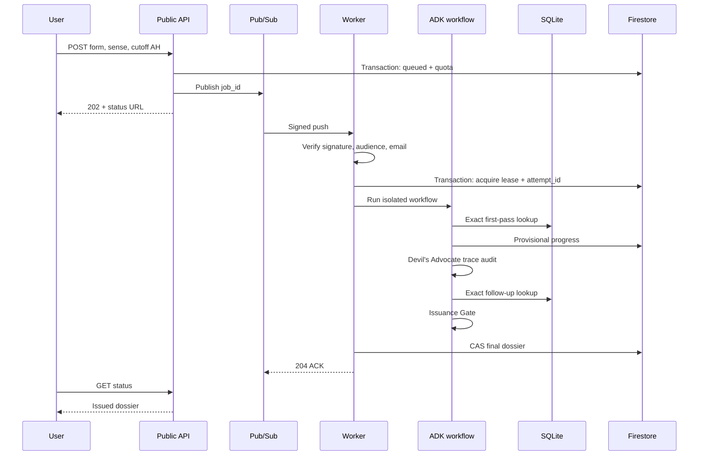
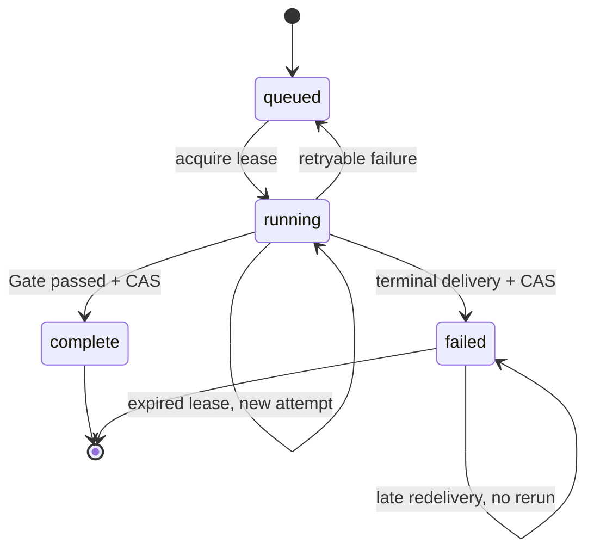

# Architecture and trust boundaries

## Execution sequence

## Trust table

| Value | Authority | Enforcement |
|---|---|---|
| Raw quote | SQLite post-markup document | Exact UTF-8 equality at stored code-point span plus whole-document hash |
| Source ID | SQLite primary key | Gate resolves again before issuance |
| Source/provenance | Hash-pinned manifest columns | Gate resolves source, parser, licence, and date fields again |
| Dates | Manifest columns with source URIs | Model output is never accepted as date metadata |
| Match existence | Postings lookup | Parameterized SQL equality |
| Match sense | Assessor | Labelled as judgement; confidence and reason retained |
| Missing search form | Devil's Advocate | Deterministic validation and exact follow-up retrieval |
| Final verdict | Code | Three-value decision function plus coverage state |
| Worker caller | Google-signed token | Signature, audience, email, verified email |
| Final writer | Current attempt | Firestore transaction compares `attempt_id` |

## Why both ADK tools and function nodes

ADK wraps the six deterministic callables as `FunctionTool` objects in `ToolRegistry`. The
orchestrator invokes those exact tool objects through `ctx.run_node` for normalization, expansion,
validation, retrieval, extraction, and verification. The orchestrator decides when each fact
tool runs instead of asking a model whether to call it. This keeps ADK load-bearing while keeping
exact retrieval outside model discretion.

## Job state

A message arriving during a valid lease receives non-2xx and is retried. A late worker can finish
its model call, but its final CAS fails if another `attempt_id` owns the job.

## Corpus supply-chain boundary

The repository contains synthetic fixtures only. A strict manifest declares the source format,
hash, release, licence, approval, bibliographic provenance, and quality limits. Plain text is kept
byte-faithful after UTF-8 decoding; the OpenITI-shaped adapter removes supported controls without
normalizing Arabic and records offsets into the exact resulting string stored in SQLite.

Real inputs and derived databases must be external to the repository. An approved build requires
an explicit command flag and `written_permission_granted` manifest status. Git/Docker ignore
rules, source-package exclusions, and a boundary scanner reject corpus-shaped files or SQLite
databases, the container image has no corpus `COPY`, and production startup rejects a
fixture-labelled database. The eventual runtime database must be mounted read-only at
`/corpus/takhrij.db` after the licence gate is cleared.
