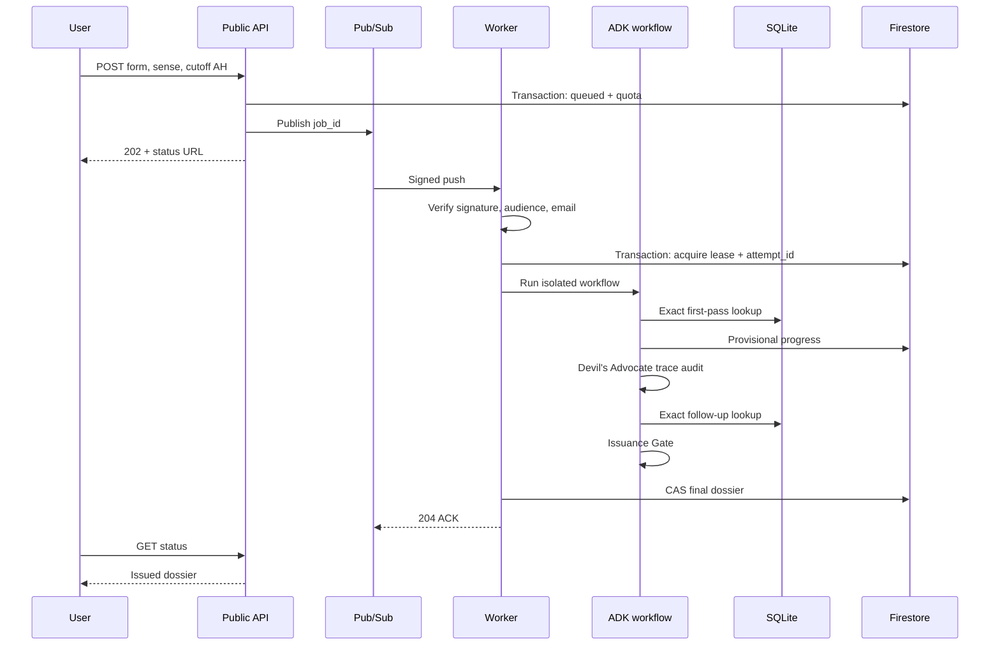
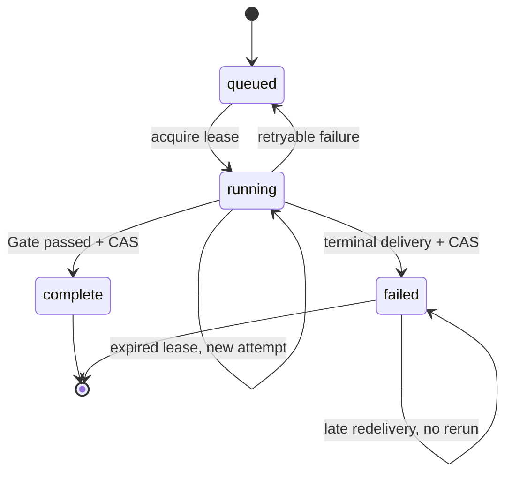

# Architecture and trust boundaries

## Execution sequence



## Trust table

| Value | Authority | Enforcement |
|---|---|---|
| Raw quote | SQLite post-markup document | Exact UTF-8 equality at stored code-point span plus whole-document hash |
| Source ID | SQLite primary key | Gate resolves again before issuance |
| Source/provenance | Hash-pinned manifest columns | Gate resolves source, parser, licence, and date fields again |
| Dates | Manifest columns with source URIs | Model output is never accepted as date metadata |
| Match existence | Postings lookup | Parameterized SQL equality |
| Match sense | Assessor semantic axis | `target_use`, `homograph`, or `uncertain`; confidence and reason retained |
| Evidence role | Assessor role axis | Independent authorial use is separate from quotation, attribution, mention, and allusion |
| Missing search form | Devil's Advocate | Deterministic validation and exact follow-up retrieval |
| Final verdict | Code | Three-value function; only target sense + independent authorial use + secure pre-cutoff date qualifies |
| Worker caller | Google-signed token | Signature, audience, email, verified email |
| Final writer | Current attempt | Firestore transaction compares `attempt_id` |

## Why both ADK tools and function nodes

ADK wraps the six deterministic callables as `FunctionTool` objects in `ToolRegistry`. The
orchestrator invokes those exact tool objects through `ctx.run_node` for normalization, expansion,
validation, retrieval, extraction, and verification. The orchestrator decides when each fact
tool runs instead of asking a model whether to call it. This keeps ADK load-bearing while keeping
exact retrieval outside model discretion.

## Job state



A message arriving during a valid lease receives non-2xx and is retried. A late worker can finish
its model call, but its final CAS fails if another `attempt_id` owns the job.

## Corpus supply-chain boundary

The repository contains synthetic fixtures and their byte-reproducible SQLite index only. A strict
manifest declares the source format, hash, release, licence, approval, bibliographic provenance,
and quality limits. Plain text is kept byte-faithful after UTF-8 decoding; the OpenITI-shaped
adapter removes supported controls without normalizing Arabic and records offsets into the exact
resulting string stored in SQLite.

Real inputs and derived databases remain external to the repository. A licence-reviewed local run
requires an explicit local-only flag, writes to a temporary external database, and records
`delivery_scope=local_only`. The web boundary refuses that state unless corpus text and free-form
model rationales are redacted server-side; the Docker image gate always rejects it.

A distribution-approved image build
requires an explicit command flag and `written_permission_granted` manifest status. The builder
creates an isolated temporary context, builds only the derived database into it, and bakes that
database into `/app/data/takhrij.db`; the Dockerfile sets mode `0444`, and SQLite is opened in
read-only mode. The Dockerfile also requires a dedicated build opt-in when database metadata says
`approved_corpus`; its default path accepts only the reproducible fixture database. Git/Docker
rules, source-package exclusions, and the boundary scanner allow only that fixture database in the
ordinary checkout. Production startup rejects a fixture-labelled database. No runtime corpus
mount or additional cloud storage service exists.

## Evidence derivation

```text
qualifies =
  semantic_class == target_use
  AND evidence_role == independent_authorial_use
  AND comparison_year_ah < cutoff_year_ah
```

Quotation can still be semantically `target_use`; it is excluded by the second axis. If either
semantic relevance or independent authorship could still be true but is unresolved before the
cutoff, the result is `INCONCLUSIVE`, never a negative verdict.
